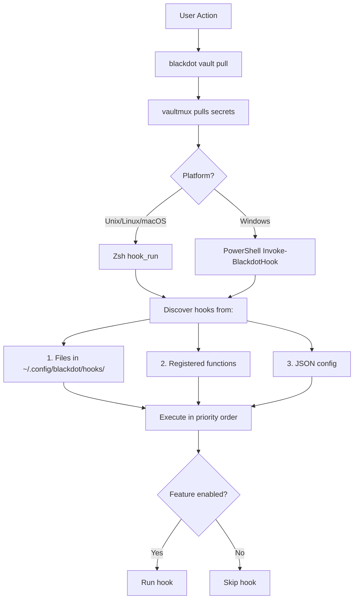

# Hook System

The hook system allows you to inject custom behavior at key lifecycle points without modifying core blackdot code. Hooks are shell scripts, functions, or commands that execute before/after major operations.

---

## Architecture: Triple-Layer System

Blackdot's hook system operates in three layers that work together:

### Layer 1: Go CLI Management (`internal/cli/hook.go`)

The Go binary provides hook management commands (cross-platform):

```bash
blackdot hook list [point]       # List hooks for all or specific point
blackdot hook run <point>        # Manually trigger hooks
blackdot hook test <point>       # Dry-run with verbose output
blackdot hook add <point> <file> # Add a hook script
blackdot hook remove <point> <name> # Remove a hook
blackdot hook points             # List all hook points
```

**Purpose:** CLI interface for discovering, managing, and manually triggering hooks.
**Platform:** Works identically on Unix/Linux/macOS/Windows

### Layer 2: Zsh Runtime Execution (`lib/_hooks.sh`)

The Zsh library provides runtime hook execution for Unix/Linux/macOS:

```bash
# In shell scripts / runtime
source "${BLACKDOT_DIR}/lib/_hooks.sh"
hook_run "post_vault_pull"       # Execute hooks at runtime
hook_register "my_point" "func"  # Register function as hook
```

**Purpose:** Execute hooks during actual operations (vault pull, setup, shell init, etc.)
**Platform:** Zsh on Unix/Linux/macOS

### Layer 3: PowerShell Runtime Execution (`powershell/Blackdot.psm1`)

The PowerShell module provides runtime hook execution for Windows:

```powershell
# In PowerShell scripts / profile
Import-Module Blackdot

# Execute hooks at runtime
Invoke-BlackdotHook -Point "post_vault_pull"

# Register PowerShell function as hook
Register-BlackdotHook -Point "shell_init" -ScriptBlock {
    Write-Host "Shell initialized"
}

# List hooks (PowerShell-specific)
Get-BlackdotHook -Point "post_vault_pull"
```

**Purpose:** Execute hooks during actual operations on Windows
**Platform:** PowerShell 5.1+ on Windows

**Key PowerShell functions:**
- `Register-BlackdotHook` - Register PowerShell scriptblocks
- `Invoke-BlackdotHook` - Run hooks at runtime
- `Get-BlackdotHook` - List hooks (like `blackdot hook list`)
- `Test-BlackdotHook` - Test hooks (like `blackdot hook test`)
- `Enable-BlackdotHooks` / `Disable-BlackdotHooks` - Toggle system

### How They Work Together



**Key points:**
- **Go CLI** = Management interface (list, add, test) - works on all platforms
- **Zsh library** = Runtime execution on Unix/Linux/macOS
- **PowerShell module** = Runtime execution on Windows (complete parity)
- **All three** read from same `~/.config/blackdot/hooks/` directory
- **Feature-gated**: Hooks respect feature registry (vault hooks skip if vault disabled)
- **Cross-platform hooks**: Place `.sh` scripts in hooks directory, they work on both Zsh and PowerShell (PowerShell calls Go CLI which executes them)

---

## Quick Start

```bash
# Create a hook directory
mkdir -p ~/.config/blackdot/hooks/post_vault_pull

# Create a simple hook
cat > ~/.config/blackdot/hooks/post_vault_pull/10-fix-permissions.sh << 'EOF'
#!/bin/bash
chmod 600 ~/.ssh/id_* 2>/dev/null
chmod 700 ~/.ssh 2>/dev/null
echo "Fixed SSH permissions"
EOF
chmod +x ~/.config/blackdot/hooks/post_vault_pull/10-fix-permissions.sh

# Verify it's registered (Go CLI)
blackdot hook list post_vault_pull

# Test the hook (Go CLI dry-run)
blackdot hook test post_vault_pull

# The hook will run automatically when you:
blackdot vault pull  # ← post_vault_pull hooks execute here
```

---

## Hook Points

### Lifecycle Hooks

| Hook | When | Use Case |
|------|------|----------|
| `pre_install` | Before `install.sh` runs | Backup existing files |
| `post_install` | After `install.sh` completes | Run custom setup |
| `pre_bootstrap` | Before bootstrap script | Check prerequisites |
| `post_bootstrap` | After bootstrap completes | Install extra packages |
| `pre_upgrade` | Before `blackdot upgrade` | Backup config |
| `post_upgrade` | After upgrade completes | Run migrations |

### Vault Hooks

| Hook | When | Use Case |
|------|------|----------|
| `pre_vault_pull` | Before restoring secrets | Backup existing secrets |
| `post_vault_pull` | After secrets restored | Set permissions, run ssh-add |
| `pre_vault_push` | Before syncing to vault | Validate secrets |
| `post_vault_push` | After vault sync | Notify/log |

### Doctor Hooks

| Hook | When | Use Case |
|------|------|----------|
| `pre_doctor` | Before health check | Custom pre-checks |
| `post_doctor` | After health check | Report to monitoring |
| `doctor_check` | During doctor | Add custom validations |

### Shell Hooks

| Hook | When (Zsh) | When (PowerShell) | Use Case |
|------|------------|-------------------|----------|
| `shell_init` | End of .zshrc | Module import | Load project-specific config |
| `shell_exit` | Shell exit (zshexit) | Module unload | Cleanup, logging |
| `directory_change` | On `cd` (chpwd) | On `cd` override | Auto-activate envs |

### Setup Wizard Hooks

| Hook | When | Use Case |
|------|------|----------|
| `pre_setup_phase` | Before each wizard phase | Custom validation |
| `post_setup_phase` | After each wizard phase | Phase-specific setup |
| `setup_complete` | After all phases done | Final customization |

### Template & Encryption Hooks

| Hook | When | Use Case |
|------|------|----------|
| `pre_template_render` | Before template rendering | Auto-decrypt .age files |
| `post_template_render` | After templates rendered | Validation, notifications |
| `pre_encrypt` | Before file encryption | Custom pre-processing |
| `post_decrypt` | After file decryption | Permission fixes, validation |

---

## Understanding Native Shell Hooks

Both Zsh and PowerShell provide native hook mechanisms that execute at specific points in the shell lifecycle. Blackdot's hook system builds on these to provide a more structured, manageable approach.

### Zsh Native Hooks

ZSH has several built-in hook arrays that you can add functions to:

| Hook Array | When It Runs | Example Use |
|------------|--------------|-------------|
| `precmd_functions` | Before each prompt is displayed | Update prompt, show git status |
| `preexec_functions` | Before each command executes | Timing, logging |
| `chpwd_functions` | After directory change (`cd`) | Auto-activate virtualenvs |
| `zshexit_functions` | When shell exits | Cleanup, save history |
| `periodic_functions` | Every `$PERIOD` seconds | Background checks |
| `zshaddhistory_functions` | Before adding to history | Filter sensitive commands |

### How Native ZSH Hooks Work

```zsh
# Method 1: Add function to hook array
my_precmd() {
    echo "About to show prompt"
}
precmd_functions+=( my_precmd )

# Method 2: Use add-zsh-hook (recommended)
autoload -Uz add-zsh-hook
add-zsh-hook precmd my_precmd
add-zsh-hook chpwd my_chpwd_function

# Remove a hook
add-zsh-hook -d precmd my_precmd
```

### Common Native Hook Patterns

**Auto-activate Python virtualenv on cd:**
```zsh
autoload -Uz add-zsh-hook

_auto_venv() {
    if [[ -f "venv/bin/activate" ]]; then
        source venv/bin/activate
    elif [[ -f ".venv/bin/activate" ]]; then
        source .venv/bin/activate
    elif [[ -n "$VIRTUAL_ENV" ]]; then
        # Deactivate if we left a venv directory
        deactivate 2>/dev/null
    fi
}
add-zsh-hook chpwd _auto_venv
```

**Command timing with preexec/precmd:**
```zsh
autoload -Uz add-zsh-hook

_timer_preexec() {
    _cmd_start=$EPOCHREALTIME
}

_timer_precmd() {
    if [[ -n "$_cmd_start" ]]; then
        local elapsed=$(( EPOCHREALTIME - _cmd_start ))
        if (( elapsed > 5 )); then
            echo "Command took ${elapsed}s"
        fi
        unset _cmd_start
    fi
}

add-zsh-hook preexec _timer_preexec
add-zsh-hook precmd _timer_precmd
```

**Filter sensitive commands from history:**
```zsh
_filter_history() {
    local cmd="$1"
    # Don't save commands with secrets
    [[ "$cmd" == *"password"* ]] && return 1
    [[ "$cmd" == *"secret"* ]] && return 1
    [[ "$cmd" == *"AWS_SECRET"* ]] && return 1
    return 0
}
add-zsh-hook zshaddhistory _filter_history
```

### PowerShell Native Hooks

PowerShell provides native event mechanisms:

| Mechanism | When It Runs | Example Use |
|-----------|--------------|-------------|
| `$PROFILE` | On shell start | Load modules, set environment |
| `Register-EngineEvent` | On PowerShell events | Monitor state changes |
| `Set-PSBreakpoint` | On variable/command access | Debug, intercept |
| `$MyInvocation.MyCommand.ScriptBlock` | On exit (finally) | Cleanup handlers |

**How Zsh hooks work:**
```zsh
# Direct assignment to hook array
precmd_functions+=(_my_function)

# Or use add-zsh-hook helper (recommended)
autoload -Uz add-zsh-hook
add-zsh-hook precmd _my_function
```

**How PowerShell hooks work:**
```powershell
# Override Set-Location for directory change hooks
function prompt {
    # Runs before each prompt (like precmd)
    Write-Host "$(Get-Location)>" -NoNewline
}

# Module import/unload hooks
$MyInvocation.MyCommand.ScriptBlock.Module.OnRemove = {
    # Cleanup on module unload (like shell_exit)
}
```

### How Blackdot Hooks Map to Native Hooks

Blackdot's hook system provides a higher-level abstraction over native shell hooks:

| Blackdot Hook | Zsh Mechanism | PowerShell Mechanism |
|---------------|---------------|---------------------|
| `shell_init` | Sourced at end of `.zshrc` | Module import (`Initialize-BlackdotModule`) |
| `shell_exit` | `zshexit_functions` array | Module OnRemove handler |
| `directory_change` | `chpwd_functions` array | `Set-LocationWithHook` override |

**Why use blackdot hooks instead of native?**

1. **File-based organization** - Hooks live in `~/.config/blackdot/hooks/`, not scattered in shell config
2. **Cross-platform** - Same hooks work on Zsh and PowerShell
3. **Easy enable/disable** - Toggle with `blackdot features` or JSON config
4. **Ordering control** - Numeric prefixes (10-, 20-, 90-) guarantee execution order
5. **Visibility** - `blackdot hook list` shows all registered hooks
6. **Testing** - `blackdot hook test` validates hooks without running them
7. **Feature gating** - Hooks respect the Feature Registry

### Using Both Systems Together

**Zsh:** You can use native ZSH hooks alongside blackdot hooks:

```zsh
# In ~/.zshrc.local - use native hooks for fast, inline operations
autoload -Uz add-zsh-hook

# Fast inline hook (native)
_update_title() {
    print -Pn "\e]0;%~\a"  # Set terminal title to current dir
}
add-zsh-hook precmd _update_title

# Complex hook (blackdot system) - lives in separate file
# ~/.config/blackdot/hooks/directory_change/10-project-env.zsh
```

**PowerShell:** You can use native PowerShell mechanisms alongside blackdot hooks:

```powershell
# In your $PROFILE - use native prompt for fast operations
function prompt {
    Write-Host "$(Get-Location)>" -NoNewline -ForegroundColor Green
    return " "
}

# Complex hook (blackdot system) - registered via module
Register-BlackdotHook -Point "directory_change" -ScriptBlock {
    # Auto-load project environment
    if (Test-Path ".\.env.ps1") { . ".\.env.ps1" }
}
```

**Best practice:** Use native hooks for simple, fast operations that need to run on every prompt. Use blackdot hooks for more complex, configurable behavior.

### Performance Considerations

**Zsh:** Native hooks run synchronously and can affect shell responsiveness:

```zsh
# BAD: Slow hook blocks every prompt
_slow_precmd() {
    git fetch origin 2>/dev/null  # Network call on every prompt!
}

# GOOD: Background the slow operation
_fast_precmd() {
    (git fetch origin 2>/dev/null &)
}

# BETTER: Only run periodically
PERIOD=300  # Every 5 minutes
_periodic_fetch() {
    git fetch origin 2>/dev/null
}
add-zsh-hook periodic _periodic_fetch
```

**PowerShell:** Similar considerations apply:

```powershell
# BAD: Slow prompt blocks shell
function prompt {
    git fetch origin 2>$null  # Network call on every prompt!
    "PS> "
}

# GOOD: Background slow operations
function prompt {
    Start-Job -ScriptBlock { git fetch origin } | Out-Null
    "PS> "
}

# BETTER: Use blackdot hooks instead of prompt
Register-BlackdotHook -Point "shell_init" -ScriptBlock {
    # Runs once on shell start, not every prompt
    git fetch origin 2>$null
}
```

---

## Hook Execution: 3 Types

The shell runtime (`lib/_hooks.sh`) discovers and executes hooks in 3 ways, in this order:

### 1. File-Based Hooks (Recommended)

**Discovered from:** `~/.config/blackdot/hooks/<point>/*.sh`

Place executable scripts in hook point directories:

```bash
~/.config/blackdot/hooks/
├── post_vault_pull/
│   ├── 10-fix-permissions.sh
│   └── 20-ssh-add.sh
├── doctor_check/
│   └── 10-custom-checks.sh
└── shell_init/
    └── 10-project-env.zsh
```

**Naming convention:** Scripts execute in alphabetical order. Use numeric prefixes:
- `10-*` - Early execution
- `50-*` - Normal priority
- `90-*` - Late execution

**Pros:** Easy to manage, visible in filesystem, easy to share
**Cons:** Requires executable permissions

**Cross-platform note:** Both `.sh` (Bash/Zsh) and `.ps1` (PowerShell) scripts work:
```bash
~/.config/blackdot/hooks/
├── post_vault_pull/
│   ├── 10-fix-permissions.sh    # Runs on Unix/Linux/macOS
│   └── 10-fix-permissions.ps1   # Runs on Windows
```

### 2. Function-Based Hooks

**Registered via:** `hook_register()` (Zsh) or `Register-BlackdotHook` (PowerShell)

**Zsh example:**
```bash
# In your shell initialization or script
source "${BLACKDOT_DIR}/lib/_hooks.sh"

my_post_pull_hook() {
    echo "Vault pulled, running custom logic"
    ssh-add ~/.ssh/id_ed25519 2>/dev/null
}

# Register the function
hook_register "post_vault_pull" "my_post_pull_hook"
```

**PowerShell example:**
```powershell
# In your PowerShell profile ($PROFILE)
Import-Module Blackdot

# Register a scriptblock as a hook
Register-BlackdotHook -Point "post_vault_pull" -ScriptBlock {
    Write-Host "Vault pulled, running custom logic"
    ssh-add "$HOME\.ssh\id_ed25519" 2>$null
} -Name "my_post_pull_hook"
```

**Pros:** Dynamic registration, conditional logic, embedded in scripts
**Cons:** Not visible via `blackdot hook list`, platform-specific (Zsh vs PowerShell)

### 3. JSON-Configured Hooks

**Configured in:** `~/.config/blackdot/hooks.json`

Define hooks declaratively:

```json
{
  "hooks": {
    "post_vault_pull": [
      {
        "name": "ssh-add",
        "command": "ssh-add ~/.ssh/id_ed25519 2>/dev/null",
        "enabled": true,
        "fail_ok": true
      },
      {
        "name": "fix-perms",
        "command": "chmod 600 ~/.ssh/id_*",
        "enabled": true
      }
    ],
    "doctor_check": [
      {
        "name": "check-vpn",
        "command": "pgrep -x 'openconnect' > /dev/null && echo 'VPN connected'",
        "enabled": true,
        "fail_ok": true
      }
    ]
  },
  "settings": {
    "fail_fast": false,
    "verbose": false,
    "timeout": 30
  }
}
```

**JSON hook properties:**
- `name` - Identifier for the hook
- `command` - Shell command to execute (works on both Zsh and PowerShell)
- `script` - Path to script file (`.sh` for Zsh, `.ps1` for PowerShell)
- `function` - Function name to call (must be loaded in current shell)
- `enabled` - Whether hook is active (default: true)
- `fail_ok` - Continue if hook fails (default: false)

**Pros:** Declarative config, easy to version control, cross-platform
**Cons:** Requires JSON editing, less flexible than code

---

## CLI Commands

**Same commands work on all platforms:**

```bash
# List all hook points and their hooks
blackdot hook list

# List hooks for a specific point
blackdot hook list post_vault_pull

# Run hooks for a point
blackdot hook run post_vault_pull

# Run with verbose output
blackdot hook run --verbose post_vault_pull

# Test hooks (shows what would run)
blackdot hook test post_vault_pull
```

**PowerShell-specific commands:**

```powershell
# List hooks using PowerShell cmdlet
Get-BlackdotHook -Point "post_vault_pull"

# Test hooks
Test-BlackdotHook -Point "post_vault_pull"

# Enable/disable hook system
Enable-BlackdotHooks
Disable-BlackdotHooks
```

---

## Example Hooks

The repository includes ready-to-use example hooks in `hooks/examples/`:

### Post Vault Pull - Fix Permissions

```bash
#!/bin/bash
# hooks/examples/post_vault_pull/10-fix-permissions.sh
# Set correct permissions on sensitive files after vault pull

# SSH keys
chmod 700 ~/.ssh 2>/dev/null
chmod 600 ~/.ssh/id_* 2>/dev/null
chmod 644 ~/.ssh/*.pub 2>/dev/null
chmod 600 ~/.ssh/config 2>/dev/null

# AWS credentials
chmod 700 ~/.aws 2>/dev/null
chmod 600 ~/.aws/credentials 2>/dev/null
chmod 600 ~/.aws/config 2>/dev/null

echo "Fixed permissions on SSH and AWS files"
```

### Post Vault Pull - SSH Add

```bash
#!/bin/bash
# hooks/examples/post_vault_pull/20-ssh-add.sh
# Add SSH keys to agent after vault pull

# Start ssh-agent if not running
if ! pgrep -u "$USER" ssh-agent > /dev/null; then
    eval "$(ssh-agent -s)" > /dev/null
fi

# Add common keys
for key in ~/.ssh/id_ed25519 ~/.ssh/id_rsa ~/.ssh/id_ed25519_github; do
    [[ -f "$key" ]] && ssh-add "$key" 2>/dev/null
done
```

### Doctor Check - Custom Validations

```bash
#!/bin/bash
# hooks/examples/doctor_check/10-custom-checks.sh
# Add custom checks to blackdot doctor

# Check VPN connection
if command -v openconnect &>/dev/null; then
    if pgrep -x "openconnect" > /dev/null; then
        echo "[OK] VPN connected"
    else
        echo "[WARN] VPN not connected"
    fi
fi

# Check required env vars
for var in GITHUB_TOKEN AWS_PROFILE; do
    if [[ -n "${!var}" ]]; then
        echo "[OK] $var is set"
    else
        echo "[WARN] $var not set"
    fi
done
```

### Shell Init - Project Environment

```zsh
#!/usr/bin/env zsh
# hooks/examples/shell_init/10-project-env.zsh
# Load work environment at shell startup

# Load direnv if available
command -v direnv &>/dev/null && eval "$(direnv hook zsh)"

# Set default AWS profile for work
[[ -z "$AWS_PROFILE" ]] && export AWS_PROFILE="work"

# Load work-specific aliases
[[ -f ~/.work-aliases ]] && source ~/.work-aliases
```

### Directory Change - Auto Environment

```zsh
#!/usr/bin/env zsh
# hooks/examples/directory_change/10-auto-env.zsh
# Auto-activate environments when entering directories

# Auto-activate Python venv
if [[ -f "venv/bin/activate" ]]; then
    source venv/bin/activate
elif [[ -f ".venv/bin/activate" ]]; then
    source .venv/bin/activate
fi

# Auto-switch Node version with nvm
if [[ -f ".nvmrc" ]] && command -v nvm &>/dev/null; then
    nvm use 2>/dev/null
fi
```

### Installing Example Hooks

```bash
# Copy an example to your hooks directory
mkdir -p ~/.config/blackdot/hooks/post_vault_pull
cp ~/workspace/blackdot/hooks/examples/post_vault_pull/10-fix-permissions.sh \
   ~/.config/blackdot/hooks/post_vault_pull/
chmod +x ~/.config/blackdot/hooks/post_vault_pull/10-fix-permissions.sh
```

---

## Feature Integration

The hook system integrates with the [Feature Registry](features.md):

- **Hooks are a feature** - Enable/disable with `blackdot features enable/disable hooks`
- **Parent feature gating** - Vault hooks only run if `vault` feature is enabled
- **Feature checks in hooks** - Use `feature_enabled "name"` in your hook scripts

```bash
# Disable all hooks
blackdot features disable hooks

# Re-enable hooks
blackdot features enable hooks --persist
```

---

## Configuration Options

### Settings in hooks.json

```json
{
  "settings": {
    "fail_fast": false,    // Stop on first hook failure
    "verbose": false,      // Show detailed output
    "timeout": 30          // Max seconds per hook
  }
}
```

### Environment Variables

| Variable | Default | Description |
|----------|---------|-------------|
| `BLACKDOT_HOOKS_VERBOSE` | `false` | Enable verbose hook output |
| `BLACKDOT_HOOKS_DISABLED` | `false` | Disable all hooks |
| `BLACKDOT_HOOKS_FAIL_FAST` | `false` | Stop on first failure |

---

## Troubleshooting

### Hook not running?

1. **Check it's executable:** `chmod +x ~/.config/blackdot/hooks/<point>/<script>`
2. **Check feature enabled:** `blackdot features | grep hooks`
3. **Check parent feature:** Vault hooks require `vault` feature enabled
4. **Test manually:** `blackdot hook test <point>`

### Hook failing silently?

Run with verbose mode:
```bash
blackdot hook run --verbose <point>
```

### View registered hooks

```bash
blackdot hook list        # All hooks
blackdot hook list <point> # Specific point
```

---

## Best Practices

1. **Use numeric prefixes** for execution order (10-, 20-, 50-, 90-)
2. **Set `fail_ok: true`** for non-critical hooks
3. **Keep hooks fast** - Shell init hooks affect startup time
4. **Use verbose logging** during development
5. **Test hooks** before relying on them: `blackdot hook test <point>`

---

## See Also

- [Feature Registry](features.md) - Control plane for hook feature
- [CLI Reference](cli-reference.md) - Full `blackdot hook` command reference
- [Design Document](design/IMPL-hook-system.md) - Implementation details
